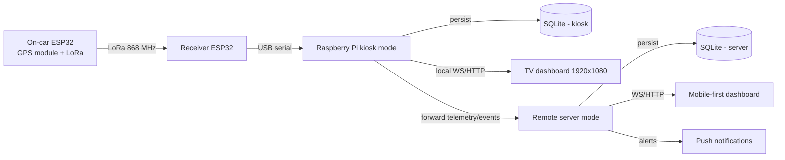

# 24h de Stan — F1 Dashboard

Dual-mode telemetry platform for CESI École d'Ingénieurs' entry in the **24h de Stan**, a student endurance race held on Place de la Carrière, Nancy, France.


<p align="center"><i>AI-generated draft</i></p>

---

## 1. Context

### The race

The **24h de Stan** is a student event in Nancy, France. Over a weekend, teams of students push (or in our case, pedal) decorated stripped-down cars around the **Place de la Carrière** for 24 hours. The "track" is a stadium-shaped loop with two long straights (~240 m each) and two tight semicircular turns at the east and west ends.

### Our entry

- **Team**: CESI Nancy
- **Brand colors**: Yellow (`#fbe216`) on black
- **Event**: 24-hour endurance, ~Saturday noon → Sunday noon

### Goal of this artifact

Two coordinated runtimes:
- A fixed-size **1920×1080 kiosk dashboard** for the stand TV (Raspberry Pi).
- A **mobile-first remote dashboard** hosted by the server for phones and off-site monitoring.

Kiosk view must be:
- Readable at **3–5 m** (typical viewing distance from stand)
- Glanceable — a passer-by should grasp the team's status in <3 seconds
- Self-updating with telemetry pulled from the on-car sensor unit
- Visually striking enough to attract an audience

### Runtime modes

The app is designed to run in one of two modes at execution time:

1. `kiosk`
- Runs on the Raspberry Pi at the stand.
- Reads incoming telemetry from the receiver ESP32 over USB serial.
- Validates and parses LoRa frames.
- Computes `RaceStats`.
- Persists raw + normalized telemetry to a **local SQLite database** on the Pi.
- Serves the TV dashboard locally over HTTP/WebSocket.
- Forwards telemetry snapshots/events to the remote `server` mode.

2. `server`
- Runs on a remote machine.
- Receives telemetry forwarded by one or more kiosks.
- Persists received telemetry/events to its own **local SQLite database**.
- Serves a **mobile-first dashboard** for organizers/team members.
- Evaluates alert rules and sends push notifications when:
  - Battery is low.
  - Data is malformed/inconsistent.
  - GPS signal is lost/degraded.
  - LoRa chain health indicates miscommunication.
  - Raspberry Pi chain health indicates miscommunication.

---

## 2. Design choices

### Visual direction

The chosen direction is **F1 broadcast aesthetic** — high-density chrome, yellow-on-black, condensed sans-serif, monospace numerals — combined with a **stylized satellite map** as the centerpiece (rather than the F1-typical mini-track). The map is the hero because it gives the audience an immediate "where is the car right now?" read that abstract track diagrams don't.

### Type system

- **Display / UI sans**: Titillium Web (700–900). Geometric, condensed, broadcast-friendly.
- **Numerals / mono**: JetBrains Mono (600–800), with `font-variant-numeric: tabular-nums` everywhere a number changes — keeps figures from jittering frame to frame.
- **Minimum body size**: 17 px. Labels are 14–17 px, primary numerals 22–138 px.

### Color tokens

| Token | Hex | Usage |
|---|---|---|
| `bg` | `#0a0a0a` | Page background |
| `panel` | `#13130f` | Panel fill |
| `border` | `rgba(255,255,255,.09)` | Panel borders |
| `yellow` (accent) | `#fbe216` | Brand, active state, primary highlight |
| `text` | `#ffffff` | Primary text |
| `textDim` | `rgba(255,255,255,.7)` | Secondary text |
| `textDimmer` | `rgba(255,255,255,.45)` | Tertiary text / units |
| `green` | `#00d97e` | OK status, top speed |
| `amber` | `#ffb000` | Warning, calories |
| `red` | `#ff3b3b` | Critical (low battery, etc.) |
| `purple` | `#bf5af2` | Best lap / personal best (F1 convention) |
| `ground` | `#1c1d1a` | Map ground tone |
| `building` | `#332e26` | Map buildings |
| `park` | `#252e20` | Park/greenery pattern |
| `road` | `#3d3a35` | Road / track tarmac |
| `trackArea` | `#88795c` | Place de la Carrière sand |

### Layout

A 3-column grid sitting under a 128 px header.

```
┌──────────────────────────────────────────────────────────────┐
│  [LOGO·CESI] [24H · TIMER · ELAPSED]  [SENSOR · LAP NUMBER]   │ 128 px
├────────────┬───────────────────────────┬─────────────────────┤
│  SPEED     │                           │  LAP TIMES          │
│  (huge)    │   PLACE DE LA CARRIÈRE    │  (best+last header  │
│            │   stylized satellite map  │   + 8 recent)       │
│  VELOCITY  │   (hero)                  │                     │
│  240s      │                           │  SECTORS            │
│            │                           │                     │
│  STATS     │                           │  WEATHER · NANCY    │
│  · DIST    ├───────────────────────────┤                     │
│  · AVG     │ LAP PROGRESS · 47.3%      │  LATEST EVENTS      │
│  · TOP     │ ████████░░░░░░ 1:23.45    │                     │
│  · KCAL    │                           │                     │
│  · PIT     │                           │                     │
└────────────┴───────────────────────────┴─────────────────────┘
   440 px           1 fr (~1000 px)            440 px
```

### Map

Stylized to read like a satellite view at a glance, but reduced to flat colored shapes for legibility from across the room:
- **Track**: two-tone tarmac stroke with dashed yellow center line
- **Buildings**: hatched pattern to suggest density without literal detail
- **Park (Pépinière)**: dotted green pattern (east of the place)
- **Center divider**: tree-lined median that splits the place lengthwise (matches the actual square)
- **Sector markers (S1–S4)**: pucks placed at the 4 turn boundaries — start of N straight, start of E turn, start of S straight, start of W turn. The active sector glows yellow.
- **Car pin**: pulsing yellow dot with car number, oriented by GPS heading
- **Heatmap dots**: 120 samples around the track, color-mapped to recent average speed (green=fast, red=slow), giving a visual cornering profile
- **Compass + scale bar**: bottom-left and top-right corners
- **Vignette**: subtle radial dark edge to push focus inward

### Sectors

We split the track at **turn boundaries** (not arbitrary 25/50/75% splits). Names: `S1 · NORTH STRAIGHT`, `S2 · EAST TURN`, `S3 · SOUTH STRAIGHT`, `S4 · WEST TURN`. Best sector times are highlighted purple per F1 convention.

### Information hierarchy (across-the-room read)

1. **Speed** (138 px yellow numeral) and **Elapsed timer** (76 px) are the largest — readable from far back.
2. **Lap number** (76 px yellow) anchors the top-right.
3. **Map** with pulsing car pin is the second visual anchor — answers "where are they?".
4. **Best/Last lap** big stats inside the LAP TIMES panel — purple/yellow distinction.
5. Everything else is reference data for engaged viewers stepping closer.

---

## 3. Data model and runtime architecture

The dashboards consume a single `RaceState` object refreshed at ~10 Hz. In production, this state is built in `kiosk` mode from telemetry received over USB serial from the receiver ESP32 on the Raspberry Pi.

### Serial JSON contract (receiver → Raspberry Pi)

The receiver ESP32 validates incoming LoRa frames (CRC check), converts raw integers to human-readable units, and writes one **newline-delimited JSON object** per valid packet over USB serial (115200 baud, `\n`-terminated).

Invalid CRC frames are silently dropped by the receiver — the RPI detects loss via `seq` gaps.

```jsonc
{
  "seq": 4821,            // uint16, 0–65535 (wraps) — packet counter, gaps indicate lost frames
  "t": 1747820400,        // uint32, Unix seconds — UTC timestamp from GPS
  "lat": 48.695200,       // float, degrees — latitude
  "lon": 6.182800,        // float, degrees — longitude
  "speed": 28.4,          // float, km/h — GPS ground speed
  "heading": 134.5,       // float, 0–360° — GPS course over ground
  "hdop": 1.4,            // float, 0.0–25.5 — horizontal dilution of precision (lower = better)
  "sats": 9,              // uint8, 0–255 — satellites used in fix
  "bat": 72,              // uint8|null, 0–100 — battery %; null if no sensor
  "cad": 85,              // uint8|null, RPM — cadence sensor; null if absent
  "fix": true,            // bool — GPS fix valid
  "fix3d": true,          // bool — fix is 3-dimensional
  "reboot": false,        // bool — first packet after ESP32 power-on
  "rssi": -67,            // int, dBm — LoRa signal strength at receiver
  "snr": 9.5              // float, dB — LoRa signal-to-noise ratio at receiver
}
```

#### What the RPI computes (not transmitted)

The following are **derived server-side** from the raw fields above:

- **Low battery alert** — from `bat < 20`
- **Heading reliability** — from `speed > ~1 km/h`
- **Packet loss rate** — from `seq` gaps over a sliding window
- **Link quality (0–1)** — from `rssi` + `snr` + loss rate
- **Lap detection, sectors, progress (`s`)** — from lat/lon projected onto the known track centerline
- **Distance, averages, top speed, heatmap** — accumulated from speed + position history
- **Calorie estimate** — from elapsed time + cadence (when available)

All higher-level statistics shown on both dashboards (lap times, sector splits, average speed, distance, calorie estimate, heatmap, etc.) are **computed from this serial input** by the Bun backend.

### `RaceStats` — backend → frontend

`RaceStats` is the object that the **Bun backend** builds from each incoming serial JSON packet (after validation, lap-detection, etc.) and pushes to frontends via **WebSocket**.

- In `kiosk` mode, `RaceStats` is sent to the stand TV dashboard and forwarded upstream.
- In `server` mode, forwarded `RaceStats` is ingested, stored, and rebroadcast to the mobile-first dashboard.

Every field rendered in either UI is derived from the serial JSON input above; nothing is sent to the browser that hasn't been computed server-side first.

### Persistence model (SQLite on both modes)

Both modes persist telemetry to SQLite, for resilience and post-race analysis:

- `kiosk` DB (edge copy on Raspberry Pi)
  - Raw serial JSON packets (for forensics/replay)
  - Decoded telemetry samples
  - Computed race snapshots (`RaceStats`)
  - Forwarding queue / delivery status to server

- `server` DB (central copy)
  - Ingested telemetry snapshots by source kiosk
  - Alert events and notification status
  - Optional long-term aggregates (laps, sectors, incidents)

This gives local survivability at the stand even if 4G drops, while preserving a central history for remote monitoring.

### Chain health and alert events

The server evaluates chain health from forwarded telemetry metadata and emits notification events. Typical categories:

- `battery_low`: battery below threshold (for example < 20%).
- `bad_data`: impossible position jumps, stale timestamps, schema mismatch, malformed JSON.
- `gps_signal_lost`: no fix, satellites too low, HDOP above threshold.
- `lora_link_problem`: packet loss spikes, long radio silence, receiver-side decode errors.
- `kiosk_link_problem`: kiosk heartbeat missing, forwarding backlog growing, server ingest timeout.

### `RaceState` shape

```ts
type RaceState = {
  // ─── Time ────────────────────────────────
  elapsed: number;             // seconds since race start
  currentLapTime: number;      // seconds in current lap

  // ─── Lap / progress ──────────────────────
  lap: number;                 // current lap number
  s: number;                   // 0..1 progress around the track
  sector: 0 | 1 | 2 | 3;       // current sector index
  lapTimes: number[];          // completed lap times (seconds)
  bestLap: number;             // seconds
  ghostDelta: number;          // delta vs best lap, seconds (+/-)
  sectorTimes: [number[], number[], number[], number[]];

  // ─── Speed ───────────────────────────────
  speed: number;               // km/h, current
  avgSpeed: number;            // km/h, race average
  topSpeed: number;            // km/h, race top
  speedHistory: { t: number, v: number }[]; // last ~240s, 1 Hz

  // ─── Position / heading ──────────────────
  // (computed downstream from `s` via buildTrack().pointAt(s))

  // ─── Heatmap ─────────────────────────────
  heatmap: number[];           // 120 buckets around the track,
                               //  exponentially-smoothed avg speed

  // ─── Pit / energy ────────────────────────
  pitStops: number;
  pitDuration: number;         // total seconds in pit
  distanceKm: number;
  calories: number;            // kcal burned, summed for 2 pedalers
                               //  at ~7 kcal/min each (moderate effort)

  // ─── Sensor health ───────────────────────
  battery: number;             // 0..1 — drains over ~22h
  signal: number;              // 0..1 — RF link quality
  satellites: number;          // count of GNSS sats in solution

  // ─── Weather ─────────────────────────────
  weather: {
    now:  { c: WxCode, t: number, w: number };  // condition, temp °C, wind km/h
    next: [Hour, Hour, Hour];                    // +1h, +2h, +3h
  };
};

type WxCode = 'sun' | 'partly' | 'cloudy' | 'shower' | 'rain';
```

### Sensor inputs (physical)

Minimum viable on-car kit:

| Sensor | Purpose | Update | Notes |
|---|---|---|---|
| **GNSS module** (u-blox NEO-M9N or similar) | Position, heading, speed, satellite count | 5–10 Hz | Required. Provides `s` (via map-matching to a known centerline), `speed`, `satellites`, raw lat/lon for heading. |
| **LiPo battery monitor** (INA226 or fuel-gauge IC) | `battery` | 1 Hz | Voltage + coulomb counting. |
| **LoRa RSSI** | `signal` | 1 Hz | Radio link quality between car and stand receiver. |
| (optional) **Cadence sensor** | Pedal RPM → kcal refinement | 1 Hz | Improves calorie estimate vs. flat 7 kcal/min. |

### Telemetry pipeline



In `kiosk` mode, the **Bun backend** on the Pi reads newline-delimited JSON from the receiver ESP32 over USB serial, builds a fresh `RaceStats` object roughly every ~100 ms, stores it in SQLite, serves it locally to the TV dashboard, and forwards snapshots to `server` mode.

In `server` mode, the backend accepts forwarded telemetry, stores a second copy in SQLite, serves a mobile-first dashboard, and emits push notifications for operational issues.

### External data

- **Lap progress `s`**: derived by projecting GPS lat/lon onto a precomputed centerline polyline of the Place de la Carrière loop (stored in the track-geometry module). Map-match every sample to nearest centerline segment, accumulate arc length.
- **Weather**: pulled hourly from **Météo-France** public forecast API, keyed by Nancy lat/lon. The simulator currently fakes a plausible 24-hour pattern (sun → afternoon shower → overnight cloud → next-day sun); the production fetch should cache the response and refresh every 30–60 minutes.

---

## 4. Repository structure

```
24h-stan-dashboard/
├── src/
│   ├── index.ts                ← Bun entrypoint. Hosts HTTP routes and mode wiring.
│   ├── index.html              ← Frontend shell.
│   ├── frontend.tsx            ← React bootstrap.
│   ├── App.tsx                 ← Dashboard app root.
│   └── index.css               ← Styles (Tailwind import).
├── build.ts                    ← Build script.
├── package.json                ← Bun scripts and dependencies.
└── README.md                   ← Project architecture and runtime docs.
```

### Planned mode split (logical modules)

As the platform evolves, the runtime is expected to be split logically as:

- `kiosk` domain
  - Serial ingestion + LoRa decode
  - Edge SQLite storage
  - TV dashboard HTTP/WS serving
  - Forwarder to server

- `server` domain
  - Forwarded telemetry ingest API
  - Central SQLite storage
  - Mobile-first dashboard HTTP/WS serving
  - Alert engine + push provider adapter

### UI surfaces by mode

- `kiosk` UI (stand TV)
  - 1920×1080 fixed-layout race dashboard
  - Prioritizes glanceability from distance and live race status

- `server` UI (remote)
  - Mobile-first dashboard
  - Prioritizes monitoring, incident visibility, and alert context for staff

---

## 5. Running modes

### To run locally

1. Install dependencies with `bun install`.
2. Start in development with `bun run dev`.
3. Open the URL printed by Bun.

### Runtime mode selection

At execution time, the app should run with a mode selector (recommended environment variable):

- `APP_MODE=kiosk`
- `APP_MODE=server`

For `kiosk` mode, telemetry input is selected with a single env var (recommended: `KIOSK_TELEMETRY_SOURCE`):

- `KIOSK_TELEMETRY_SOURCE=/dev/ttyUSB0` (or any serial device path): read newline-delimited JSON from the receiver ESP32 over serial.
- `KIOSK_TELEMETRY_SOURCE=simulated`: use simulated telemetry instead of reading serial data.

Expected behavior:

- `kiosk`: serial ingest + local SQLite + TV dashboard + forward upstream.
- `server`: ingest from kiosk + local SQLite + mobile-first dashboard + push alerts.

### To deploy at the stand

1. Run the Bun service in `kiosk` mode on Raspberry Pi.
2. Connect receiver ESP32 over USB serial.
3. Ensure kiosk SQLite database is writable on local storage.
4. Connect Raspberry Pi HDMI to stand TV and open kiosk dashboard fullscreen.
5. Configure upstream server endpoint for telemetry forwarding.

### To deploy remote monitoring

1. Run the Bun service in `server` mode on a remote machine.
2. Ensure server SQLite database is writable.
3. Expose ingest endpoint for kiosk forwarding.
4. Expose mobile-first dashboard endpoint over HTTPS.
5. Configure push provider credentials and alert routing.

### Known limitations
- The current weather data is **simulated** — production needs a Météo-France fetch with caching.
- The heatmap is computed in the browser from `speedHistory`. For very long races (24 h), consider downsampling on the server.
- Alert thresholds, retry policies, and push provider integration still need final tuning for race conditions.
- The kiosk dashboard is designed for 1920×1080 TVs; the remote dashboard is mobile-first.

---

## 6. Credits

- Design + implementation: this project
- Track shape source: satellite imagery of Place de la Carrière, Nancy
- Fonts: [Titillium Web](https://fonts.google.com/specimen/Titillium+Web), [JetBrains Mono](https://www.jetbrains.com/lp/mono/) — both open-source, loaded via Google Fonts
- Weather source (production): Météo-France public forecast API
- F1 broadcast aesthetic: drawn from public coverage conventions (yellow/purple/green sector coloring, dense panel chrome)

CESI École d'Ingénieurs · 24h de Stan 2026
