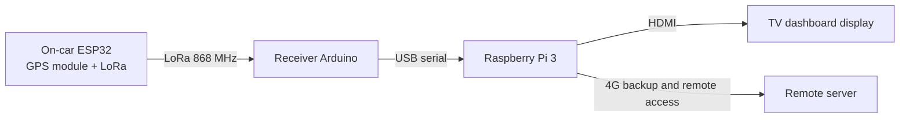

# 24h de Stan — F1 Dashboard

Live telemetry dashboard for CESI École d'Ingénieurs' entry in the **24h de Stan**, a student endurance race held on Place de la Carrière, Nancy, France.


<p align="center"><i>AI-generated draft</i></p>

---

## 1. Context

### The race
The **24h de Stan** is a student event in Nancy, France. Over a weekend, teams of students push (or in our case, pedal) decorated stripped-down cars around the **Place de la Carrière** for 24 hours. The "track" is a stadium-shaped loop with two long straights (~240 m each) and two tight semicircular turns at the east and west ends.

### Our entry
- **Team**: CESI Nancy
- **Brand colors**: Yellow (`#fbe216`) on black
- **Event**: 24-hour endurance, ~Saturday noon → Sunday noon

### Goal of this artifact
A single fixed-size **1920×1080 dashboard** designed to run on a TV at the team's stand. It must be:
- Readable at **3–5 m** (typical viewing distance from stand)
- Glanceable — a passer-by should grasp the team's status in <3 seconds
- Self-updating with telemetry pulled from the on-car sensor unit
- Visually striking enough to attract an audience

---

## 2. Design choices

### Visual direction
The chosen direction is **F1 broadcast aesthetic** — high-density chrome, yellow-on-black, condensed sans-serif, monospace numerals — combined with a **stylized satellite map** as the centerpiece (rather than the F1-typical mini-track). The map is the hero because it gives the audience an immediate "where is the car right now?" read that abstract track diagrams don't.

### Type system
- **Display / UI sans**: Titillium Web (700–900). Geometric, condensed, broadcast-friendly.
- **Numerals / mono**: JetBrains Mono (600–800), with `font-variant-numeric: tabular-nums` everywhere a number changes — keeps figures from jittering frame to frame.
- **Minimum body size**: 17 px. Labels are 14–17 px, primary numerals 22–138 px.

### Color tokens
| Token | Hex | Usage |
|---|---|---|
| `bg` | `#0a0a0a` | Page background |
| `panel` | `#13130f` | Panel fill |
| `border` | `rgba(255,255,255,.09)` | Panel borders |
| `yellow` (accent) | `#fbe216` | Brand, active state, primary highlight |
| `text` | `#ffffff` | Primary text |
| `textDim` | `rgba(255,255,255,.7)` | Secondary text |
| `textDimmer` | `rgba(255,255,255,.45)` | Tertiary text / units |
| `green` | `#00d97e` | OK status, top speed |
| `amber` | `#ffb000` | Warning, calories |
| `red` | `#ff3b3b` | Critical (low battery, etc.) |
| `purple` | `#bf5af2` | Best lap / personal best (F1 convention) |
| `ground` | `#1c1d1a` | Map ground tone |
| `building` | `#332e26` | Map buildings |
| `park` | `#252e20` | Park/greenery pattern |
| `road` | `#3d3a35` | Road / track tarmac |
| `trackArea` | `#88795c` | Place de la Carrière sand |

### Layout
A 3-column grid sitting under a 128 px header.

```
┌──────────────────────────────────────────────────────────────┐
│  [LOGO·CESI] [24H · TIMER · ELAPSED]  [SENSOR · LAP NUMBER]   │ 128 px
├────────────┬───────────────────────────┬─────────────────────┤
│  SPEED     │                           │  LAP TIMES          │
│  (huge)    │   PLACE DE LA CARRIÈRE    │  (best+last header  │
│            │   stylized satellite map  │   + 8 recent)       │
│  VELOCITY  │   (hero)                  │                     │
│  240s      │                           │  SECTORS            │
│            │                           │                     │
│  STATS     │                           │  WEATHER · NANCY    │
│  · DIST    ├───────────────────────────┤                     │
│  · AVG     │ LAP PROGRESS · 47.3%      │  LATEST EVENTS      │
│  · TOP     │ ████████░░░░░░ 1:23.45    │                     │
│  · KCAL    │                           │                     │
│  · PIT     │                           │                     │
└────────────┴───────────────────────────┴─────────────────────┘
   440 px           1 fr (~1000 px)            440 px
```

### Map
Stylized to read like a satellite view at a glance, but reduced to flat colored shapes for legibility from across the room:
- **Track**: two-tone tarmac stroke with dashed yellow center line
- **Buildings**: hatched pattern to suggest density without literal detail
- **Park (Pépinière)**: dotted green pattern (east of the place)
- **Center divider**: tree-lined median that splits the place lengthwise (matches the actual square)
- **Sector markers (S1–S4)**: pucks placed at the 4 turn boundaries — start of N straight, start of E turn, start of S straight, start of W turn. The active sector glows yellow.
- **Car pin**: pulsing yellow dot with car number, oriented by GPS heading
- **Heatmap dots**: 120 samples around the track, color-mapped to recent average speed (green=fast, red=slow), giving a visual cornering profile
- **Compass + scale bar**: bottom-left and top-right corners
- **Vignette**: subtle radial dark edge to push focus inward

### Sectors
We split the track at **turn boundaries** (not arbitrary 25/50/75% splits). Names: `S1 · NORTH STRAIGHT`, `S2 · EAST TURN`, `S3 · SOUTH STRAIGHT`, `S4 · WEST TURN`. Best sector times are highlighted purple per F1 convention.

### Information hierarchy (across-the-room read)
1. **Speed** (138 px yellow numeral) and **Elapsed timer** (76 px) are the largest — readable from far back.
2. **Lap number** (76 px yellow) anchors the top-right.
3. **Map** with pulsing car pin is the second visual anchor — answers "where are they?".
4. **Best/Last lap** big stats inside the LAP TIMES panel — purple/yellow distinction.
5. Everything else is reference data for engaged viewers stepping closer.

---

## 3. Data model

The dashboard consumes a single `RaceState` object refreshed at ~10 Hz. In the prototype this is generated by a deterministic simulator (`useRaceState` hook in `engine.jsx`); in production it would be fed by an ESP32 on the car (GPS + LoRa), received by an Arduino at the stand, then ingested over USB serial by a Raspberry Pi 3.

### `RaceState` shape

```ts
type RaceState = {
  // ─── Time ────────────────────────────────
  elapsed: number;             // seconds since race start
  currentLapTime: number;      // seconds in current lap

  // ─── Lap / progress ──────────────────────
  lap: number;                 // current lap number
  s: number;                   // 0..1 progress around the track
  sector: 0 | 1 | 2 | 3;       // current sector index
  lapTimes: number[];          // completed lap times (seconds)
  bestLap: number;             // seconds
  ghostDelta: number;          // delta vs best lap, seconds (+/-)
  sectorTimes: [number[], number[], number[], number[]];

  // ─── Speed ───────────────────────────────
  speed: number;               // km/h, current
  avgSpeed: number;            // km/h, race average
  topSpeed: number;            // km/h, race top
  speedHistory: { t: number, v: number }[]; // last ~240s, 1 Hz

  // ─── Position / heading ──────────────────
  // (computed downstream from `s` via buildTrack().pointAt(s))

  // ─── Heatmap ─────────────────────────────
  heatmap: number[];           // 120 buckets around the track,
                               //  exponentially-smoothed avg speed

  // ─── Pit / energy ────────────────────────
  pitStops: number;
  pitDuration: number;         // total seconds in pit
  distanceKm: number;
  calories: number;            // kcal burned, summed for 2 pedalers
                               //  at ~7 kcal/min each (moderate effort)

  // ─── Sensor health ───────────────────────
  battery: number;             // 0..1 — drains over ~22h
  signal: number;              // 0..1 — RF link quality
  satellites: number;          // count of GNSS sats in solution

  // ─── Weather ─────────────────────────────
  weather: {
    now:  { c: WxCode, t: number, w: number };  // condition, temp °C, wind km/h
    next: [Hour, Hour, Hour];                    // +1h, +2h, +3h
  };
};

type WxCode = 'sun' | 'partly' | 'cloudy' | 'shower' | 'rain';
```

### Sensor inputs (physical)
Minimum viable on-car kit:

| Sensor | Purpose | Update | Notes |
|---|---|---|---|
| **GNSS module** (u-blox NEO-M9N or similar) | Position, heading, speed, satellite count | 5–10 Hz | Required. Provides `s` (via map-matching to a known centerline), `speed`, `satellites`, raw lat/lon for heading. |
| **Wheel hall-effect sensor** | Backup speed / distance | ~50 Hz | Cross-check against GNSS; survives GPS dropouts. |
| **LiPo battery monitor** (INA226 or fuel-gauge IC) | `battery` | 1 Hz | Voltage + coulomb counting. |
| **LoRa RSSI (ESP32 + receiver Arduino)** | `signal` | 1 Hz | Radio link quality between car and stand receiver. |
| **4G modem status (Raspberry Pi 3 gateway)** | backup uplink health | 0.2-1 Hz | Optional status for remote server forwarding and fallback monitoring. |
| (optional) **Cadence sensor** | Pedal RPM → kcal refinement | 1 Hz | Improves calorie estimate vs. flat 7 kcal/min. |

### Telemetry pipeline


The dashboard is a static HTML/JS bundle displayed directly from the Raspberry Pi 3 over HDMI on the stand TV. A local process on the Pi reads USB serial frames from the receiver Arduino, builds a fresh `RaceState` JSON message roughly every ~100 ms, serves it to the dashboard (WebSocket or SSE), and forwards snapshots to a remote server over 4G for backup and remote access.

### External data
- **Lap progress `s`**: derived by projecting GPS lat/lon onto a precomputed centerline polyline of the Place de la Carrière loop (the centerline is hardcoded in `engine.jsx` as `TRACK`). Map-match every sample to nearest centerline segment, accumulate arc length.
- **Weather**: pulled hourly from **Météo-France** public forecast API, keyed by Nancy lat/lon. The simulator currently fakes a plausible 24-hour pattern (sun → afternoon shower → overnight cloud → next-day sun); the production fetch should cache the response and refresh every 30–60 minutes.

---

## 4. File structure

```
Perso - 24h stan/
├── Dashboard.html              ← Entry point. Mounts a DesignCanvas with one
│                                 1920×1080 artboard hosting <ComboDashboard />.
├── design-canvas.jsx           ← Pan/zoom canvas wrapper (review tool only —
│                                 not used at the stand; on race day, render
│                                 ComboDashboard at fullscreen instead).
├── engine.jsx                  ← Track geometry + race-state simulator.
│                                 Exposes: TRACK, buildTrack, sectorOf,
│                                 sectorBoundaryS, useRaceState, fmt,
│                                 SECTOR_NAMES, getWeatherForecast.
├── dashboard-combo.jsx         ← The dashboard itself (~400 lines).
│                                 Exposes: ComboDashboard.
└── tweaks-panel.jsx            ← (Unused in production; review-mode only.)
```

### Key utilities (`engine.jsx`)

- `buildTrack({ cx, cy, halfLen, radius })` — returns `{ d, length, pointAt(s) }`. `d` is an SVG `path` for a stadium loop centered at `(cx,cy)`. `pointAt(s)` returns `{x, y, heading}` where `s ∈ [0,1)`.
- `sectorBoundaryS(i)` — returns the `s` value where sector `i` begins (4 sectors, split at turn entries/exits).
- `sectorOf(s)` — returns 0..3.
- `fmt.time(seconds)` → `"HH:MM:SS"` for the elapsed clock
- `fmt.lap(seconds)` → `"M:SS.cs"` for a lap time
- `fmt.delta(seconds)` → `"+0.42"` / `"-1.17"`
- `fmt.dec(n, d)`, `fmt.int(n)` — numeric formatting

### Dashboard structure (`dashboard-combo.jsx`)

```
<ComboDashboard width=1920 height=1080>
  ├── <CmbTopBar>                    — header with logo, timer, sensor, lap
  │     └── <CmbSensor>              — battery + satellites + signal bars
  ├── <CmbLeft>                      — 440 px column
  │     ├── <CmbPanel "SPEED">       — huge numeral + 50-bar mini-history
  │     ├── <CmbPanel "VELOCITY 240s">  — waveform
  │     └── <CmbPanel "STATS">       — distance, avg, top, kcal, pits
  ├── <CmbCenter>                    — flexible center column
  │     ├── <CmbPanel "PLACE DE LA CARRIÈRE · NANCY">
  │     │     └── <CmbSatMap>        — the map (SVG, ~280 lines)
  │     └── <LapProgress>            — bar + sector ticks + lap time
  └── <CmbRight>                     — 440 px column
        ├── <CmbPanel "LAP TIMES">   — best+last header, 8 recent
        ├── <CmbPanel "SECTORS">     — 4 rows, active highlighted, best=purple
        ├── <CmbWeather>             — now + next 3 hours, Météo-France
        └── <CmbPanel "LATEST EVENTS"> — feed of best laps, pits, top speeds
</ComboDashboard>
```

---

## 5. Reproducing this

### To run locally
1. Clone / download the project folder.
2. Serve the directory over HTTP (e.g. `python -m http.server`). File-protocol won't work because of Babel module fetches.
3. Open `Dashboard.html` in Chrome. The DesignCanvas wrapper lets you zoom and focus the artboard.

### To deploy at the stand
1. Strip the DesignCanvas wrapper — replace the contents of the `App` function in `Dashboard.html` with a direct `<ComboDashboard />` render that auto-scales to viewport (use a CSS `transform: scale()` based on `window.innerWidth / 1920`).
2. Replace `useRaceState` (the simulator) with a hook that listens to a local endpoint on the Raspberry Pi 3 (WebSocket or SSE) and merges incoming `RaceState` messages.
3. On the Raspberry Pi 3, run a small gateway service that reads USB serial data from the receiver Arduino, parses LoRa telemetry frames, maintains the latest `RaceState`, serves it locally to the dashboard, and forwards snapshots to a remote server over 4G.
4. Connect the Raspberry Pi 3 HDMI output to the stand TV and run Chrome in kiosk mode on the Pi: `chrome --kiosk --disable-features=TranslateUI http://localhost:3000/Dashboard.html`.

### To extend
- **More sensors**: add fields to `RaceState`. Keep sensor health indicators in the header, performance data in the columns.
- **Alerts**: a banner across the top of the center column when battery < 20%, signal lost > 10 s, or pit-stop required.
- **Multi-car (if rules allow)**: the map and sector list already render generically — add a `cars: Car[]` field and iterate.
- **Race playback**: log every `RaceState` to a JSONL file on the server. Replay by piping the log through the same WebSocket broadcaster at variable speed.

### Known limitations
- The current weather data is **simulated** — production needs a Météo-France fetch with caching.
- The heatmap is computed in the browser from `speedHistory`. For very long races (24 h), consider downsampling on the server.
- No persistence: a page refresh resets visible state until the next telemetry frame arrives. The server should always replay the latest snapshot on WebSocket connect.
- Designed for 1920×1080 TVs. Other resolutions will letterbox via the wrapper transform.

---

## 6. Credits

- Design + implementation: this project
- Track shape source: satellite imagery of Place de la Carrière, Nancy
- Fonts: [Titillium Web](https://fonts.google.com/specimen/Titillium+Web), [JetBrains Mono](https://www.jetbrains.com/lp/mono/) — both open-source, loaded via Google Fonts
- Weather source (production): Météo-France public forecast API
- F1 broadcast aesthetic: drawn from public coverage conventions (yellow/purple/green sector coloring, dense panel chrome)

CESI École d'Ingénieurs · Team Nancy · Car #42 · 24h de Stan 2026
